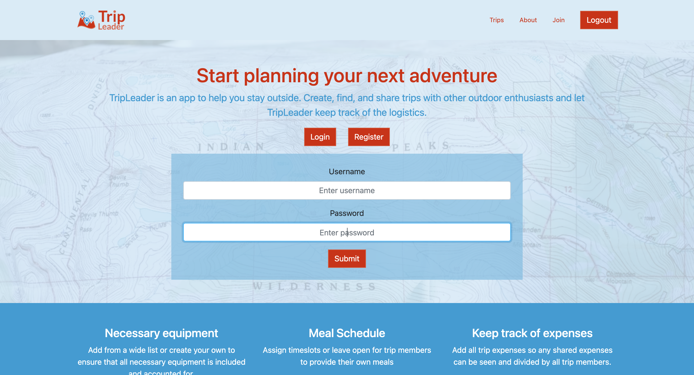

# TripLeader App
This application is intended to be used as a tool to plan single- and multi-day outings in the outdoors or any other occasion with a focus on logistics, meals, and expenses. It is intended to be expanded upon once basic functionality is established. 

## Project Description
The SandBar project makes use of the Spring framework (Spring Boot) and MySQL for the back-end REST API. For the front end an Angular app makes calls to the REST API and handles user views. 

### MySQL DB and JPA Project 
Once the user stories and DB schema was established, JPASandBar was created as a Gradle project to model and communicate with the DB. The project incorporates JPA (Hibernate) and JDBC driver (MySQL) to connect with the DB, and uses JUnit testing to ensure data and relationships are accurate. I used project lombok to reduce boilerplate code. This project is meant to be a dependency of the main Spring Boot project on which REST endpoints will serve the data modeled in this JPA project. 

### Spring Boot Project
The confluence project brings in JPASandbar as a dependency and sets up the API endpoints that, using services and repositories, operate CRUD functions on the required entities to serve data or perform the required functions. This project is secured using Spring Security Basic Auth. The project incorporates Spring actuator endpoints for monitoring and logging as well as user profiles for dev and production.   

### Angular Project
This project displays all user views and logic by making calls to the REST API and other API's as necessary. It uses Angular 12 with Bootstrap 4.6 and Ng Bootstrap to build the UI. 

